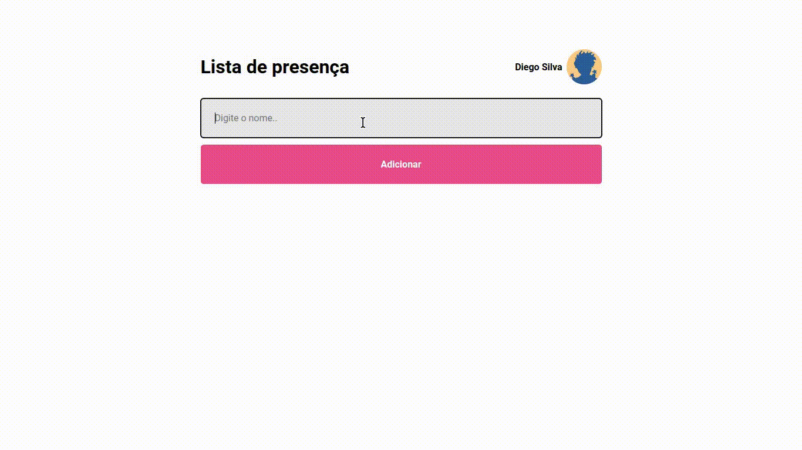

# lista-de-presenca
Pequeno projeto em React que consome a API do GitHub, desenvolvido durante o curso Discover da Rocketseat.

## Descrição
O projeto cria uma lista de presença através de um campo de entrada para o nome. A aplicação foi desenvolvida utilizando conceitos de hooks do React e faz uso da API do GitHub.

## Curso:
[Discover](https://app.rocketseat.com.br/discover/)

## Bibliotecas utilizadas
* [React](https://pt-br.reactjs.org/) - Utilizado para criar a interface.
* [Vite](https://vitejs.dev/) - Utilizado para iniciar o projeto.
